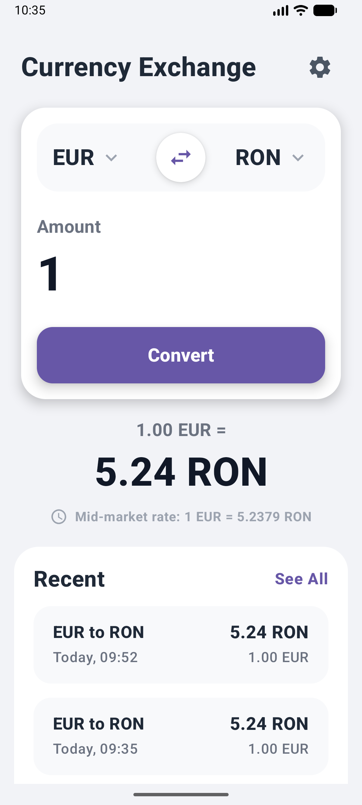
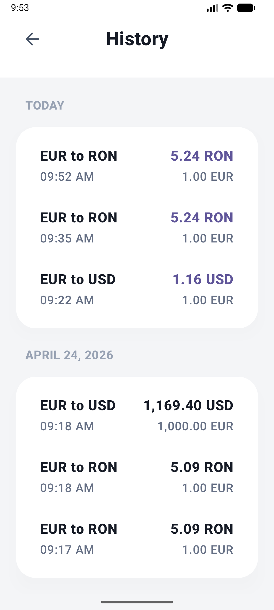
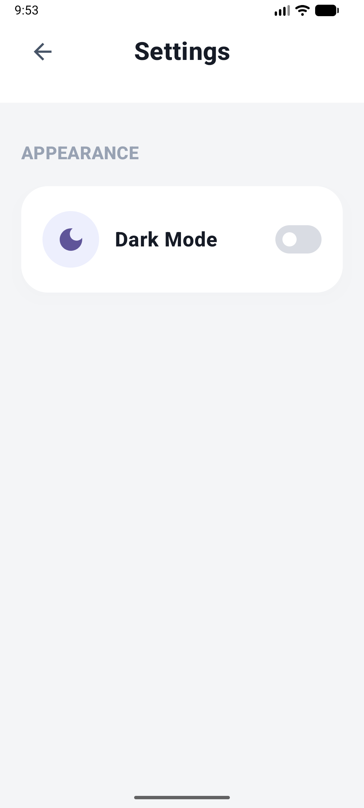
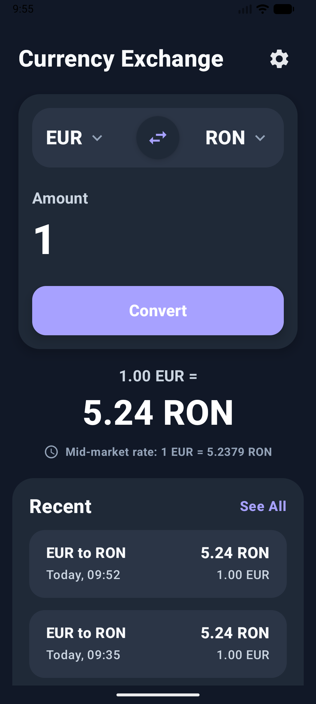
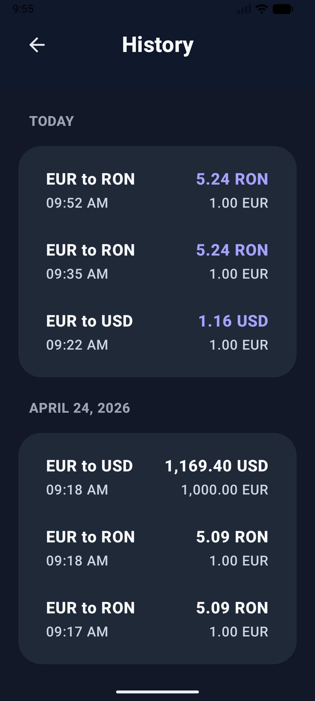
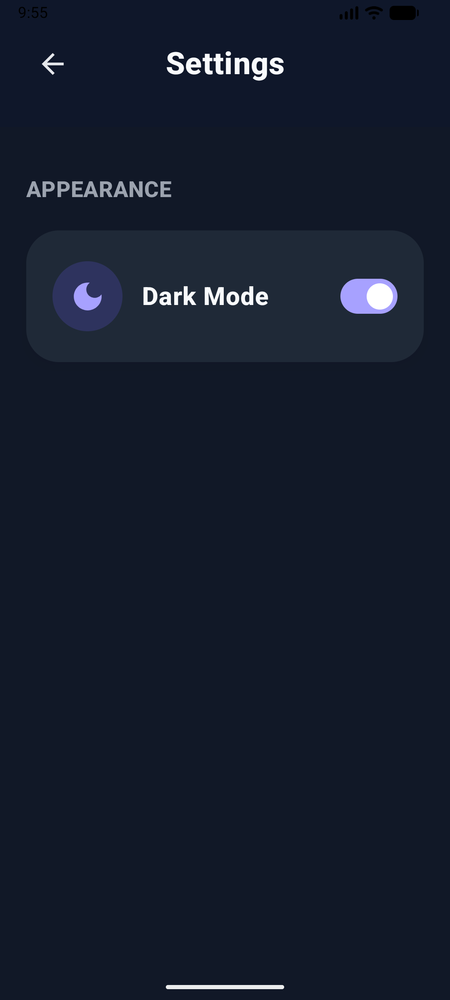
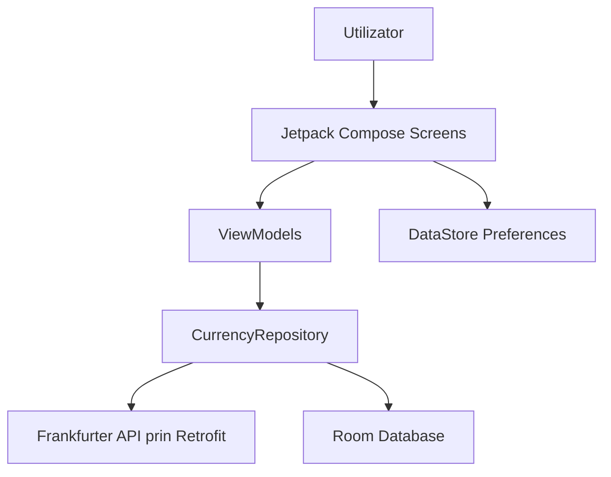
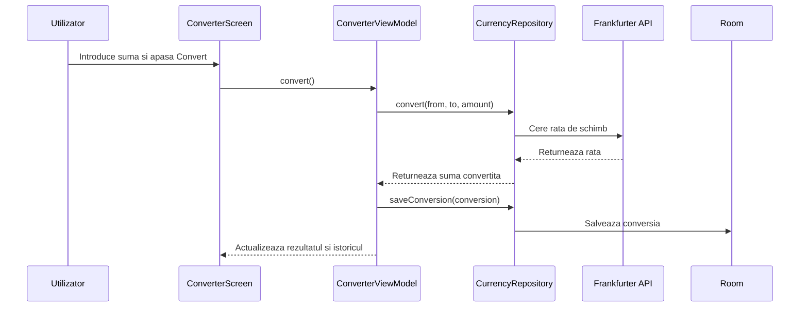

# TADAM Project - Currency Exchange

**Nume:** Cosmin BORSAN  
**Grupa:** Financial Computing (SPF)

## Descriere

TADAM Project este o aplicatie Android pentru conversii valutare. Utilizatorul poate alege doua monede, introduce o suma, vedea rezultatul conversiei si consulta istoricul conversiilor facute anterior.

Aplicatia foloseste cursuri valutare reale prin API-ul Frankfurter si salveaza local conversiile in baza de date Room. Include si un ecran de setari pentru schimbarea temei light/dark.

## Functionalitati principale

- conversie valutara intre monedele USD, EUR, GBP, RON, JPY si CHF;
- selectie pentru moneda sursa si moneda destinatie;
- buton pentru inversarea rapida a monedelor;
- afisarea rezultatului si a ratei de schimb folosite;
- istoric local al conversiilor;
- gruparea istoricului pe zile;
- ecran de setari cu mod intunecat;
- validarea inputului pentru suma introdusa;
- teste unitare pentru logica din `ConverterViewModel`.

## Ecrane

Aplicatia are trei ecrane principale:

1. **Currency Exchange** - ecranul principal pentru introducerea sumei si conversie.
2. **History** - lista conversiilor salvate local.
3. **Settings** - setarea temei light/dark.

Navigarea intre ecrane este facuta cu Jetpack Navigation Compose.

### Screenshot-uri

#### Tema light

| Currency Exchange | History | Settings |
| --- | --- | --- |
|  |  |  |

#### Tema dark

| Currency Exchange | History | Settings |
| --- | --- | --- |
|  |  |  |

## Tehnologii folosite

- **Kotlin** - limbajul principal al aplicatiei;
- **Jetpack Compose** - interfata grafica declarativa;
- **Material 3** - componente UI;
- **Navigation Compose** - navigare intre ecrane;
- **ViewModel + StateFlow** - administrarea starii UI;
- **Retrofit + Gson** - comunicare cu API-ul extern;
- **Frankfurter API** - sursa pentru ratele de schimb valutar;
- **Room** - baza de date locala pentru istoric;
- **DataStore Preferences** - salvarea preferintei de tema;
- **JUnit + kotlinx-coroutines-test** - teste unitare.

## Arhitectura aplicatiei

Aplicatia urmeaza o arhitectura pe straturi:



### Rolul componentelor

- `ConverterScreen`, `HistoryScreen`, `SettingsScreen` definesc interfata aplicatiei.
- `ConverterViewModel` gestioneaza suma, monedele selectate, rezultatul, erorile si istoricul.
- `SettingsViewModel` gestioneaza preferinta pentru dark mode.
- `CurrencyRepository` centralizeaza accesul la API si baza de date.
- `FrankfurterApiService` descrie endpoint-ul Retrofit pentru rate valutare.
- `ConversionHistoryDao` lucreaza cu tabela locala `conversion_history`.
- `ThemePreferences` foloseste DataStore pentru persistarea temei.

## Fluxul unei conversii



## Cerinte acoperite

| Cerinta | Implementare |
| --- | --- |
| Kotlin | Proiectul este scris in Kotlin |
| Jetpack Compose | Ecranele sunt construite cu Compose |
| Cel putin doua ecrane | Exista trei ecrane: conversie, istoric, setari |
| Jetpack Navigation | `AppNavigation` foloseste `NavHost` si rute Compose |
| Arhitectura recomandata | UI + ViewModel + Repository + Data layer |
| Integrare API | Retrofit consuma Frankfurter API |
| Baza de date | Room salveaza istoricul conversiilor |
| Protectie la SQL injection | Room foloseste DAO si query-uri parametrizate/controlate |
| Comunicare securizata | API-ul este accesat prin HTTPS |
| Settings screen | Exista ecran de setari pentru dark mode |
| Unit testing | Exista teste pentru `ConverterViewModel` |
| Cod modular | Codul este impartit in pachete `ui`, `data`, `model`, `theme`, `navigation` |

## Structura proiectului

```text
app/src/main/java/com/example/tadamproject
├── data
│   ├── local          # Room database si DAO
│   ├── preferences    # DataStore pentru tema
│   ├── remote         # Retrofit API service
│   └── CurrencyRepository.kt
├── model              # Entitatea ConversionHistory
├── ui
│   ├── converter      # Conversie si istoric
│   ├── navigation     # Rutele aplicatiei
│   ├── settings       # Setari si dark mode
│   └── theme          # Culori si tema
├── AppContainer.kt
├── MainActivity.kt
└── TadamApplication.kt
```

## Rulare

Pentru rulare este necesar Android Studio cu Android SDK instalat.

1. Deschideti proiectul in Android Studio.
2. Asteptati sincronizarea Gradle.
3. Porniti un emulator sau conectati un telefon Android.
4. Rulati configuratia `app`.

Alternativ, din terminal:

```bash
./gradlew installDebug
```

## Testare

Testele unitare pot fi rulate cu:

```bash
./gradlew test
```

Testele verifica scenarii importante din conversie:

- actualizarea rezultatului dupa conversie;
- salvarea conversiei in istoric;
- tratarea erorilor;
- inversarea monedelor si resetarea rezultatului.

## Concluzie

Aplicatia acopera cerintele proiectului printr-o implementare Android completa: interfata Compose, navigare intre ecrane, API extern, persistenta locala, setari, validare de input si teste unitare. README-ul poate fi folosit si ca suport vizual pentru prezentarea finala.
